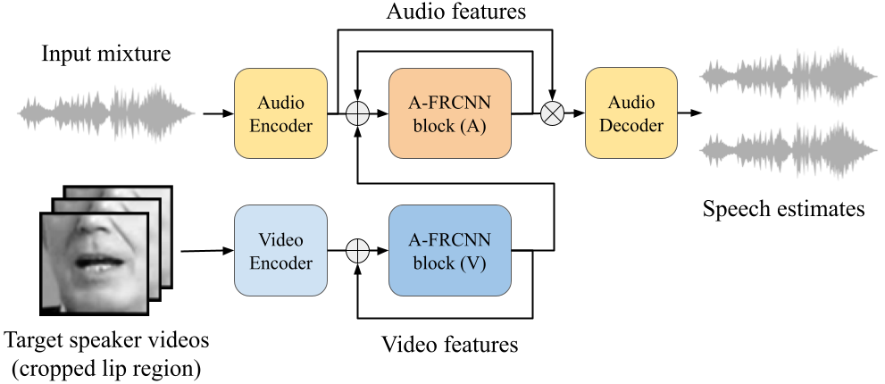

______________________________________________________________________

<div align="center">

# AVLIT: Audio-Visual Lightweight ITerative model

<a href="https://pytorch.org/get-started/locally/"></a>
<!-- <a href="https://pytorchlightning.ai/"></a> -->
<!-- <a href="https://hydra.cc/"></a> -->
<!-- <a href="https://github.com/ashleve/lightning-hydra-template"></a><br> -->
<!-- [](https://www.nature.com/articles/nature14539) -->
<!-- [](https://papers.nips.cc/paper/2020) -->

</div>

> 🚀: The code will be released soon.

## Description
Official Pytorch Lightning implementation of "Audio-Visual Speech Separation in Noisy Environments with a Lightweight Iterative Model", accepted at INTERSPEECH 2023.

|            |            |
|:----------:|:----------:|
|        |         |
|  |  |
| (A) Folded view of AVLIT | (B) Unfolded view of AVLIT |

Audio-Visual Lightweight ITerative model (AVLIT) uses the A-FRCNN as building block. 
It uses a homogeneous design to process multi-modal data and the weights are shared for each modality, making the number of parameters constant. Please refer to the paper for details.

# Quick start

## Installation

Make sure to have ``pytorch`` with GPU support installed on your machine according to the official installation guide.

## Basic usage

Here is a minimal example of how to use AVLIT in plain Pytorch. The default parameters will produce the configuration for AVLIT-8, which is the best performing model in the paper.

```python
from avlit import AVLIT

# Instantiate the model
model = AVLIT(
    num_sources = 2,
    # Audio branch
    audio_num_blocks = 8,
    # Video branch
    video_num_blocks = 4,
    video_encoder_checkpoint = "path/to/ae.ckpt",
)
model.cuda()

# Training or inference logic here
# ...

```

## Advanced usage

For more control over the architecture, it is possible to provide values for more parameters as follows:

```python
from avlit import AVLIT

# Instantiate the model
model = AVLIT(
    num_sources = 2,
    # Audio branch
    kernel_size = 40,
    audio_hidden_channels = 512,
    audio_bottleneck_channels = 128,
    audio_num_blocks = 8,
    audio_states = 5,
    # Video branch
    video_hidden_channels = 128,
    video_bottleneck_channels = 128,
    video_num_blocks = 4,
    video_states = 5,
    video_encoder_checkpoint = "path/to/ae.ckpt",
    video_encoder_trainable = False,
    video_embedding_dim = 1024,
    # AV fusion
    fusion_operation = "sum",
    fusion_positions = [4],
)
model.cuda()

# Training or inference logic here
# ...

```

# Citation

If you use AVLIT in your research, please cite our paper:
```
[Citation coming soon]
```

# Contact

* For **bugs** or **issues with the code**, please open an issue in this repository.
* For **technical/academic questions** please write an email to the corresponding authors mentioned in the paper.
* For **other inquiries**, contact me via email at hmartelb@hotmail.com. 

# License

This code is licensed under the terms of the MIT License.

```
MIT License
Copyright (c) 2023 Héctor Martel

Permission is hereby granted, free of charge, to any person obtaining a copy
of this software and associated documentation files (the "Software"), to deal
in the Software without restriction, including without limitation the rights
to use, copy, modify, merge, publish, distribute, sublicense, and/or sell
copies of the Software, and to permit persons to whom the Software is
furnished to do so, subject to the following conditions:

The above copyright notice and this permission notice shall be included in all
copies or substantial portions of the Software.

THE SOFTWARE IS PROVIDED "AS IS", WITHOUT WARRANTY OF ANY KIND, EXPRESS OR
IMPLIED, INCLUDING BUT NOT LIMITED TO THE WARRANTIES OF MERCHANTABILITY,
FITNESS FOR A PARTICULAR PURPOSE AND NONINFRINGEMENT. IN NO EVENT SHALL THE
AUTHORS OR COPYRIGHT HOLDERS BE LIABLE FOR ANY CLAIM, DAMAGES OR OTHER
LIABILITY, WHETHER IN AN ACTION OF CONTRACT, TORT OR OTHERWISE, ARISING FROM,
OUT OF OR IN CONNECTION WITH THE SOFTWARE OR THE USE OR OTHER DEALINGS IN THE
SOFTWARE.
```
